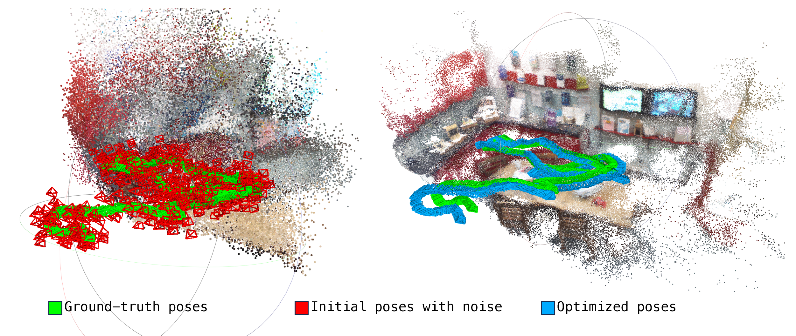

# Final Project for Computer Vision

> Summer Semester 2024, Heidelberg University

We introduce feature selection in Scene Coordinate Regression (SCR) to reduce the impact caused by poorly distinguishable features; pose optimization over Lie algebra facilitates the direct use of visual odometry poses as supervision, thus lifting the dependence on the SfM step.



## Dependencies

This code uses PyTorch and has been tested on Ubuntu 22.04 with a RTX 4060 Laptop GPU, although it should reasonably run with other Linux distributions and GPUs as well. 

Create and activate the environment with:

```bash
conda env create -f environment.yml
conda activate scr
```

Install `DSAC*`

```bash
cd dsacstar
python setup.py install
cd ..
```

## Datasets

Setup datasets:

```bash
cd data
python setup_7scenes.py
python setup_cambridge.py
cd ..
```

## Run Example

Details in `demo.ipynb`

Train model e.g. for Cambridge GreatCourt dataset:

```bash
mkdir results_folder

python train.py "data/Cambridge_GreatCourt/train/rgb/*.png" results_folder/ace_network.pt --pose_files "data/Cambridge_GreatCourt/train/poses/*.txt"  --pose_refinement none --use_external_focal_length 740 --use_aug False --patch_threshold 0.1
```

Re-Localization:

```bash
python reloc.py "data/Cambridge_GreatCourt/test/rgb/*.png" results_folder/ace_network.pt --use_external_focal_length 740 --session query
```

Evaluation of Re-Localization results:

```bash
python eval_poses.py results_folder/poses_query.txt "data/Cambridge_GreatCourt/test/poses/*.txt" --pose_error_thresh_t 1
```

Export point cloud:

```bash
python export_point_cloud.py results_folder/point_cloud_out.txt --network results_folder/ace_network.pt --pose_file results_folder/poses_ace_network_preliminary.txt
```

Then you can visualize the point cloud in `MeshLab` or in `demo.ipynb`

## Report Experiments

We provide scripts to run the main experiments of the report.

For feature selection:

```bash
bash scripts/test_7scenes_thr.sh
bash scripts/test_cambridge_thr.sh
```

Testing pose optimization on a single dataset, e.g. 7Scenes Kitchen:

```bash
python add_noise.py
python train.py "data/7scenes_source/redkitchen/seq-14/*.color.png" results_folder/ace_network.pt --pose_files "data/7scenes_source/redkitchen/seq-14/*.pose_noisy.txt"  --pose_refinement adamw --use_external_focal_length 525 --use_aug False
python reloc.py "data/7scenes_redkitchen/test/rgb/*.color.png" results_folder/ace_network.pt --session query
python eval_poses.py  results_folder/poses_query.txt "data/7scenes_redkitchen/test/poses/*.pose.txt"
```

Batch test pose optimization:

```bash
bash scripts/test_7scenes_pose.sh
bash scripts/test_cambridge_pose.sh
```

## Acknowledgements:

Our code is modified from [ACE0](https://github.com/nianticlabs/acezero). Thank the authors for their open-sourced code.
